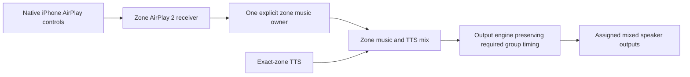
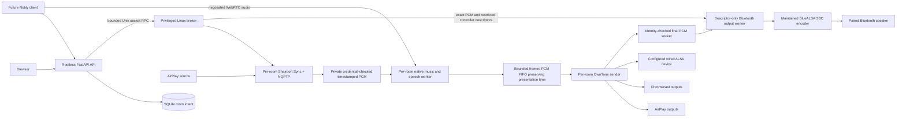

# Shiri architecture

Every Shiri zone must expose an AirPlay 2 input receiver,
routing native phone playback to its explicitly assigned mixed
speaker outputs. Listeners use existing phone casting controls; the admin web
interface is not a playback prerequisite. Room configuration is
durable intent; running processes, discovered devices and acknowledged backend
state are observations. A saved assignment never means an unreachable speaker
is playing.

The persisted API term `room` denotes that configured zone. TTS targets the
exact zone, and native iPhone selection of multiple AirPlay 2 zones must retain
synchronization through the final output stage. These requirements are defined
in [PRODUCT_REQUIREMENTS.md](PRODUCT_REQUIREMENTS.md).

This document distinguishes the required architecture from the current clean
candidate on `codex/shiri-rebuild`. Verified native multi-zone output timing
remains a release gate. The user explicitly deferred Cast input on October 1;
its future adapter must meet the same source ownership boundary. Cast speaker
outputs remain supported. The source actor and AirPlay
runtime ownership boundary are implemented. The release
gates in [REBUILD.md](REBUILD.md) remain open.

## Required receiver and source boundary

AirPlay and any future Cast adapter must share an explicit source policy. Takeover, rejection,
volume, pause, stop and disconnect need source/session identities; callbacks
from a superseded producer must not affect the current owner. TTS remains a
separate bounded overlay: lower the music gain while its timeline continues,
mix speech, then restore gain smoothly. It must not pause, seek, restart or
reconnect music, or disconnect the phone. `shiri/source.py` defines the policy;
`runtime/source.py` serializes grants, downstream barriers and final writes.
`runtime/native.py` binds exact AirPlay transport handles and forwards native
volume through durable receipts. A future supported Cast input adapter must
use this same ownership boundary; no Cast receiver is currently installed.

The policy grants the newest serialized input request and issues an exact
token containing zone, actor incarnation, protocol, producer session identity
and monotonically increasing grant epoch. End/volume callbacks require that
whole current token. Takeover revokes only the previous token; reused native
IDs or callbacks from a previous actor cannot change the new owner. An
identical admission request from the current producer is idempotent.
The admission ID must identify the exact connection or speech negotiation
incarnation. An adapter must combine a reusable native ID with a fresh
connection generation; otherwise a new connection could be mistaken for a
replay of the live producer. That generated ID remains stable for retries of
one genuine admission, and exact native identifiers are never guessed.

Adapters must serialize genuine admission requests, commit state before
actions, advance epochs within an actor and begin a fresh actor incarnation
after restart. Retired incarnations cannot regain authority. Takeover emits
`revoke_input` for the old token before
`grant_input` for the new token. Before admitting new PCM, the adapter must
acknowledge the old route's quiescence, or atomically fence it and discard its
buffered PCM. Media can arrive before a control callback and stopping a producer
can take time: every PCM write needs `owns_input`, not just a start-time check.
`permits_action` rejects queued grants, volume changes and mix-gain changes
made obsolete by newer state. Its check and effect initiation must share the
zone actor's serialization; a backend without token fences must remain
serialized through bounded acknowledgment so an old asynchronous write cannot
finish after a newer one. A revoke uses an adapter handle bound to that exact
old token, never a generic handle for the current AirPlay source.

| Event | Required identity | Result |
| --- | --- | --- |
| `input_requested` | Exact zone, protocol and producer session ID including connection generation | Newest admission wins; current identical admission is idempotent |
| `input_ended` | Whole current `SourceToken` | Ends only that music owner |
| `input_volume_changed` | Whole current `SourceToken`, integer 0–100 | Changes only the current producer's volume |
| `tts_started` | Exact zone, bounded negotiation identity and finite gain 0–1 | Grants a separate `OverlayToken`; changes music mix gain only |
| `tts_ended` | Whole current `OverlayToken` | Restores music gain without changing its owner or timeline |

Speech has its own monotonically increasing epoch. Reused speech IDs and late
end/gain actions cannot restore a newer overlay's gain. TTS never emits music
grant/revoke actions; gain transitions must be applied smoothly by the mixer.
The most recent overlay token is retained as a gain-action fence after its end,
without retaining a live speech owner.
Turning a delayed playback-status callback into a new admission would bypass
the policy. The reducer's tests establish event and action rules, not native
receiver enforcement, atomic physical takeover or acoustic behavior.

Before future Cast input is enabled, discovery, authentication, media playback and streaming must be
validated using stock phones and existing apps. An OwnTone Chromecast output
is not an inbound receiver; advertising mDNS alone or demonstrating a custom
sender does not pass this requirement. No Cast input adapter has passed the
admission tests. Cast input is deferred for this release.
[Receiver evaluation](RECEIVER_RESEARCH.md), [current feasibility](CAST_INPUT_FEASIBILITY.md)

## Implemented candidate process and audio boundaries

The product API imports no GStreamer or privileged networking code. It validates
requests, enforces authentication, saves room intent and reconciles that intent
through a small RPC contract. The broker alone creates namespaces and starts
owned processes. Each audio worker mixes music with one speech producer; it
does not discover or open network speakers.

The root broker retains its singleton, manifest and setup/cleanup authority.
The current launcher uses fixed separate non-root room identities for input,
output and decoding workers, private mount views and exact device grants.
OwnTone waits behind a root-controlled launch gate until its exact cgroup has
verified persistent kernel bind policies and those identities are saved. Local
outputs inherit a filter allowing only libasound's necessary read/preference
control ioctls; hardware parameters follow an opened-PCM identity check.
Executables and configuration are read-only to workers; writable database,
cache and FIFO paths are private. Network input workers have no root DAC
authority or host system D-Bus access. The combined boundary passed actual
Ubuntu kernel and guarded virtual PCM checks; full playback and crash coverage
remain explicit in [REBUILD.md](REBUILD.md).

Hook RPC admits only the expected daemon UID and its exact room's bounded
music/volume signals. Those credentials do not authorize general broker
operations and differ from the rootless administration API's socket rights.
The native socket checks the exact receiver UID and every media callback
requires the admitted incarnation, session, epoch and native generation.

The PCM contract is 48 kHz, stereo, signed 16-bit little-endian between mixer
and OwnTone. Speech is decoded and resampled to 48 kHz mono before mixing.
The patched Shairport backend delivers the actual first-sample presentation
anchor with 48 kHz stereo S16 PCM through a private versioned socket. Input
format, complete frame count and clock provenance are checked at this boundary;
the foundation's ALSA receiver capture path remains earlier evidence rather
than proof of this new path.
Queues and FIFO writes are bounded. If the reader vanishes or the pipe fills,
the worker drops live audio and records counters instead of retaining an
unbounded backlog of stale speech.

Explicit local outputs request `audio.software_volume = true` from the
maintained OwnTone 29.3 extension. The validated foundation used the
`29.3-shiri-swvol1` build marker; subsequent timing, source-transition and
opened-PCM identity extensions have separate reviewed patches and exact markers.
Preflight must require the exact features used by its profile. Upstream's hardware-mixer path rejects
mixerless Loopback and can reuse a PCM address as an invalid control address.
The extension scales a private copy at final PCM submission using the current
local session's volume, including buffered and draining audio. It leaves other
outputs' samples and OwnTone's playback timing unchanged, creates no shared
ALSA mixer controls and preserves the upstream hardware-mixer default when
the option is absent. This local output volume is separate from TTS's music
duck gain; speech must never restart or replace a music/output session.
The dedicated Ubuntu API-to-final-PCM check exercised this extension: local
volume `100 → 50 → 100` changed the observed music amplitude by the expected
cubic gain while the sampled program, selection and process identities stayed
stable. Exact results and the synthetic/Loopback scope are recorded in
[REBUILD.md](REBUILD.md). Physical speaker and Bluetooth verification remain
required.

Bluetooth uses a separate descriptor-only output worker. The root broker
admits one exact paired A2DP endpoint through the maintained BlueALSA service
and hands only its validated PCM pipe and restricted controller descriptors to
that worker. OwnTone sends its clocked, volume-adjusted final PCM over an exact
published socket; the worker forwards it without another scheduler or sample
conversion. It has no host D-Bus connection or ALSA nodes. The prior Loopback
return/host-bus worker route is replaced. Real private-daemon SBC/controller
and separate kernel publication checks passed; the combined broker/OwnTone/
BlueALSA route and physical device remain acceptance gates. See
[BLUETOOTH_OUTPUT.md](BLUETOOTH_OUTPUT.md) for ownership, bounds and evidence.

OwnTone owns speaker delivery, buffering and playback timing. Its documented
pipe input supports an AirPlay receiver forwarding audio into an OwnTone
multiroom router. [OwnTone pipe input documentation](https://owntone.github.io/owntone-server/library/)

## Room identity and ownership

Rooms have UUID identities and at most eight explicit ALSA Loopback slots. A
display name, advertised AirPlay name, exact optional Nobly room ID and Linux
interface are separate fields. Display and AirPlay names must be unique after
case folding. The receiver name is bounded to 50 UTF-8 bytes and cannot contain
Shairport's hostname/version substitutions. Configuration text is escaped by
the runtime adapter rather than interpolated as raw configuration syntax.

Speaker assignments use numeric OwnTone output IDs, never IP addresses or a
best-effort name match. A network output is exclusive across all rooms,
including disabled rooms. AirPlay 1 and AirPlay 2 representations of the same
OwnTone ID do not create two independently owned speakers. Local output ID `0`
is scoped by the configured physical ALSA endpoint because every OwnTone
instance can expose its own local output with that ID. Equivalent `hw`/`plughw`
forms and default device/subdevice indexes share one ownership key; BlueALSA
MAC address case does not create a second endpoint. Numeric ALSA card indexes
remain normalizable for explicit migration/audit analysis, but room admission
and actual playback reject them. Device/subdevice indexes may remain numeric.
The playback address preserves an explicitly requested `plughw` converter;
canonicalizing an ownership key must not remove rate/format conversion.
An existing database containing a numeric card fails startup read-only
validation with an operator-repair message; it is not rewritten or mapped to
whichever card currently occupies that index. Legacy migration likewise needs
an operator-supplied named endpoint. Automatically assigned names for identical
USB cards can also reorder, so named admission alone is not a physical identity
guarantee. Stable provisioned card IDs or serial/udev identity and verified
rejection on mismatch remain required hardening.
Selecting local audio requires an explicit device; the default is disabled.
Configured local devices are exclusive even for disabled rooms without a
selected local output, because enabling a Bluetooth bridge opens that device.

Local device values are restricted to explicit `hw`/`plughw` hardware routes or
`bluealsa:DEV=MAC,PROFILE=a2dp`. Arbitrary ALSA plugins, `file` routes, embedded
configuration and untrusted aliases are rejected before reaching a privileged
process. Quoting a plugin string would not stop that plugin from writing files
with the process's privileges.

Nobly room routing requires an exact saved external ID and one matching room.
Missing bindings fail visibly. No default room, guessed slug, name fallback or
first available room receives the speech. Nobly itself has not been built or
connected; Shiri provides the room-addressed integration boundary.

`POST /api/v1/nobly/rooms/{external_id}/speech` admits offers only. Binding
resolution and the bounded runtime admission acknowledgment share the same
guard as room edits, so rebinding cannot change the destination mid-admission.
Successful speech responses include `admitted_room_id`, the stable room UUID.
Control and close use `/api/v1/rooms/{admitted_room_id}/speech`; the external-ID
endpoint rejects those follow-ups with an actionable error. A later binding
move therefore cannot redirect an old session's close into its successor.
The existing broker's active session-to-room ownership rejects a lost-offer-
acknowledgment retry that would retarget a retained session after rebinding.
There is no second ephemeral ownership map in the API service.

Each room accepts one WebRTC speech session with explicit `session_id` and
`request_id`. The session ID identifies one exact producer/negotiation
generation and remains stable only for retries of that generation. A competing
producer receives a conflict. Negotiation, transport
failure, cancellation, inactivity and room shutdown dispose that session. Music
ducking follows audible received audio, with bounded attack/release, rather than
the mere existence of a WebRTC connection. This establishes music/speech
mixing. Arbitration between phones and input protocols remains required work,
including stale-event protection and real device verification.

The speech path must preserve continuous music playback and phone ownership.
Offer, received speech, control, close, timeout and failure handling must never
invoke music pause/seek/restart, reconnect output sessions or replace the
music producer. Only music mix gain changes, with smooth restoration.
The actual Linux two-tone mixer test provides a basis for checking music gain
under speech, but physical output continuity and phone-control continuity
remain required evidence. There is no exclusive TTS interruption policy.

## Durable intent and reconciliation

Pydantic models reject unknown fields, implicit numeric coercion, nonfinite
gains and out-of-range volumes or offsets. SQLite owns room, slot, name,
external-binding and speaker uniqueness. Mutations and operational events
commit together with WAL, full synchronization, foreign keys and a bounded
busy timeout. Optimistic room revisions prevent one browser from silently
overwriting another browser's edit. Full-disk and malformed-database failures
surface errors; they do not replace user state with an empty installation.
Startup validates the managed column order/types/defaults, primary and unique
keys, collations, foreign-key actions, checks and generated-ID semantics. SQL
keyword case, comments and harmless nonunique indexes do not change that
contract. Unmanaged tables, views and triggers fail closed. The bounded room
audit also recomputes canonical names, physical devices and speaker ownership,
checks retained calibration and volume receipts, and rejects inconsistent
derived keys without repairing them. Deleted-room receipts/events remain
valid history; intentionally retained profiles are validated as a stream.
Existing files receive WAL-aware read-only validation before writable startup,
so rejecting a crashed invalid database cannot trigger a last-writer checkpoint
or discard committed WAL intent. A missing or empty main file with a retained
WAL, shared-memory or journal companion is rejected before writable access,
including dangling companion symlinks. Validation is repeated under the normal
write transaction before accepting the store.

Phone volume callbacks have durable event identities. Their receipt and room
revision commit in the same transaction. If an acknowledgment is lost, replay
returns the original committed revision even when a newer UI edit exists.
This prevents a coalesced phone update from being incorrectly rebased on, and
overwriting, that newer UI intent. Receipt history is bounded to 10,000 events.

Saving intent succeeds independently of the backend reaching that intent. API
responses report whether runtime reconciliation was accepted; room status and
diagnostics expose pending, starting, running, degraded or error states. Backend
selection requires acknowledgment and readback. A missing member of a requested
speaker group leaves the room degraded and clears the live selection instead
of silently playing a partial or old group.

Each room converges serially toward its newest definition. Shared sender
reservations cover rooms that are still starting. Material changes to the
receiver or local device restart the relevant runtime; ordinary speaker,
volume and timing changes use the backend control adapter. Health checks
observe processes, namespaces, DHCP state, audio worker and OwnTone rather than
treating a remembered PID as health. Recovery uses bounded backoff.

## Network lifecycle

Receiver namespaces have their own LAN macvlan, DHCP identity, private D-Bus,
Avahi and NQPTP shared-memory isolation. OwnTone instances share one sender
namespace and sender timing services, while retaining separate player
instances and control ports. The host reaches the sender through a private
veth link using a subnet checked against existing routes. The receiver LAN
interface must be suitable for multiple MAC addresses; VM bridging is a
deployment requirement, not something a successful DHCP lease proves.

The durable ownership manifest records installation identity, namespace inode,
interface MAC/alias and process identity. Cleanup must verify ownership before
stopping a process, releasing a DHCP lease or deleting a namespace. It never
authorizes host cleanup by a name prefix alone. A failed teardown retains
ownership so recovery can inspect and retry it.

The API listens on loopback by default. Installation credentials protect
control requests; browser sessions are HTTP-only and cross-origin mutations
are rejected. Unix socket RPC verifies peer users and bounds message size and
duration. LAN exposure requires an explicit deployment choice and TLS at the
HTTP boundary. These controls do not imply that the legacy VM has already been
replaced by this runtime.

## Timing and supported transports

| Transport | Current route | Timing claim |
| --- | --- | --- |
| AirPlay 1 / AirPlay 2 speaker | OwnTone network output | Protocol timing within one sender; physical accuracy still measured |
| Chromecast speaker | OwnTone network output | Approximate alignment; precise mixed-protocol sync is not promised |
| Wired ALSA speaker | Explicit Linux hardware endpoint | Device buffering and drift must be measured |
| Paired Bluetooth speaker | OwnTone final PCM → descriptor-only worker → maintained BlueALSA SBC encoder | Combined route still under validation; device/adapter buffering, drift and physical verification pending |
| PulseAudio | Recognized backend capability | Requires an installed/configured adapter; not enabled by the ALSA runtime automatically |
| Google Cast as an input | Deferred by the user | A future adapter needs stock-phone discovery, authentication, media and streaming validation |
| WebRTC speech | One bounded room audio session | Mixed into that room before OwnTone delivery |

OwnTone's Chromecast documentation explicitly excludes precise synchronization
with other output types. Device discovery therefore does not establish
compatibility or acoustic timing quality. [OwnTone Chromecast documentation](https://owntone.github.io/owntone-server/audio-outputs/chromecast/)

OwnTone exposes a per-output `offset_ms` in the range `-2000..2000`; a positive
value delays that output. Shiri stores this correction by speaker identity so
it survives deselection. This corrects a measured constant relative delay, not
clock drift or variable jitter. [OwnTone 29.3 output API](https://github.com/owntone/owntone-server/blob/29.3/docs/json-api.md#change-an-output)

An offset readback confirms the configured value, not its acoustic effect.
OwnTone 29.3 cannot change the offset inside an active playback session; its
paused-output path tears down that session so the next start uses the value.
The adapter pauses when necessary, changes/readbacks the offsets and resumes.
That is an explicit administrative calibration operation; no speech admission,
media, close or failure path may invoke it.
Failure during that sequence must remain visible. [OwnTone 29.3 player implementation](https://github.com/owntone/owntone-server/blob/29.3/src/player.c#L2743-L2771)

## Required native grouping and the timestamp-preserving candidate

The current unit of playback is one room's OwnTone instance. Speakers selected
by that instance receive one room program. Different room instances remain
independent players even when they share a LAN namespace or PTP
daemon. Playing the same file independently in two rooms does not synchronize
those rooms. Receiver-side synchronization from an iPhone also does not prove
that independent FIFO/player relay stages preserve that common presentation
timeline at the final speakers.

Native iPhone multi-zone selection is required behavior. The implementation
preserves the group's shared presentation timeline through capture, mixing
and OwnTone's existing timestamped input seam. It must still verify final
outputs during startup, regrouping and long playback. The
[timing audit and bounded experiment](TIMING_RESEARCH.md) records the original
clock-provenance loss and the maintained correction. Portable callback tests
and successful native builds establish that correction's exercised contracts;
the two-zone final-PCM test and later phone/acoustic evidence remain required.

The next native candidate implements a timestamp-preserving boundary instead
of scheduling speakers outside OwnTone. Its pinned Shairport backend receives
the native first-sample presentation time and original RTP frame position from
the actual playback callback, after resampling and partial-frame skipping.
Every connection has a fresh producer identity; flushes advance an exact native
generation. An authenticated source transition fences and discards old queued
music, waits for downstream output acknowledgments, then grants the new route.
Every final music write checks that exact live token. Speech admission, media
and close never invoke this source transition or replace its music owner.

Each block carries a fresh paired `CLOCK_MONOTONIC_RAW`/`CLOCK_MONOTONIC`
measurement. The `shiri-timed2` producer retries a scheduling-disrupted clock
triple at most four times and admits only samples completed before a total
five-millisecond deadline. OS preemption can return later, in which case the
sample fails. The receiving
limit stays at one millisecond; retries preserve the native presentation time,
RTP position and exact PCM payload. Exhaustion closes the exact producer route
without sending an invalid mapping or advancing its timed-frame counters. The
mixer preserves the mapped native deadline and adds one frozen common relay
horizon. The current policy freezes `H = max(enabled room B) + 100 ms`:
zero-offset local/framed Bluetooth uses B40/H140, Cast/Pulse B250/H350 and
AirPlay B500/H600. Selected negative speaker corrections enlarge B to retain
the route's required lead and can raise the common horizon; positive offsets
never lower a route's floor. Every enabled zone shares that horizon, including
zones with different output leads. See [the timing policy](TIMING_RESEARCH.md).
The framed OwnTone input subtracts
its existing output buffer duration before supplying `INPUT_FLAG_SYNC`; the
existing player timer starts absolutely at that program anchor. Its output
buffer then adds the duration back. This avoids inventing independent
receive-time origins or accidentally adding another two seconds to the declared
horizon. Late or missing first anchors, stale operations, repeated native
presentation times and old flush generations fail closed.

Portable tests compile the actual patched callbacks, pipe reader, input-marker
boundary and both player timer variants under address/undefined-behavior
sanitizers. Two independent receiver connections with different arrival times
and RTP origins retain the same native group deadline; modeled transport delays
still require explicit compensation. These tests establish the exercised code
contracts, not real output scheduling or acoustic alignment. New-profile Linux
PCM evidence and stock-phone/physical-speaker acceptance remain mandatory.
OwnTone's Cast output does not currently provide a proven precise presentation
clock or a receiver-queue flush acknowledgment. Constant offsets cannot remove
unmeasured jitter or drift.

The speech producer now uses a separate bounded Unix datagram endpoint. The
output daemon owns its private directory and authenticates the exact audio UID,
room UUID and launch generation. OwnTone polls it without blocking on its player
thread and mixes mono speech into the shared stereo PCM immediately before
output conversion. This removes the native-ingress wait from announcements;
it does not bypass device buffers or cold playback activation. A 250 ms packet
age/queue bound prevents stale accumulation. Ordinary EOF drains valid voice
samples, and absent media cannot hold music ducked indefinitely. Producer health
distinguishes input activity and datagram delivery from actual backend gain;
final-output measurements remain authoritative. A concurrent source-only flush
can still discard already-transmitted speech in device buffers; seamless takeover
remains a separate gate. Speech itself never invokes that flush.

The pinned Shairport configuration documents an optional progress metadata
anchor containing an RTP frame position and its intended local
`CLOCK_MONOTONIC_RAW` presentation time, in nanoseconds, using `phb0`/`phbt`
messages, with `CLOCK_MONOTONIC` as the documented fallback. It is emitted
when the frame enters the backend buffer, ahead of presentation. This is a
concrete research path for carrying receiver timing provenance across the
relay. Baseline metadata is enabled using a private `metadata/shairport.pipe`,
with cover art disabled and a 100 ms pipe timeout. Disabling metadata in the
pinned receiver caused an actual startup crash and was reverted. Progress
anchors remain disabled and unconsumed. The next framed profile carries the
actual native playback callback anchor directly rather than parsing these
optional progress messages; the validated foundation's raw FIFO erased it.
The anchor option has not been validated in this candidate and does not
establish final-output synchronization or justify
a new speaker scheduler without evidence.
[Pinned Shairport configuration](https://github.com/mikebrady/shairport-sync/blob/7bad231c18368dbd26f298577f6210e36e4b0797/scripts/shairport-sync.conf#L305-L318)

`runtime/backend.py` is the OwnTone adapter boundary. If reproducible acoustic
evidence identifies an OwnTone output defect, fix and pin that backend first.
A different backend requires measured improvement, compatible real devices,
ownership/recovery tests and an explicit migration plan. Sendspin is a candidate
because its protocol defines timestamped audio and continuous clock offset and
drift estimation; a specification's targets do not prove a deployed endpoint's
accuracy or make existing AirPlay/Cast speakers native Sendspin clients.
[Sendspin protocol specification](https://www.sendspin-audio.com/build/spec/#clock-synchronization)

See [CALIBRATION.md](CALIBRATION.md) for the measurement stages and
[REBUILD.md](REBUILD.md) for verification evidence and release gates.
