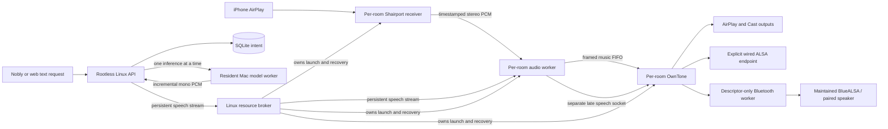

# Shiri architecture

Shiri exposes an AirPlay 2 receiver for each enabled room and sends its music
and targeted speech to explicitly assigned outputs. A room is a zone, not a
physical speaker. Different rooms may play different programs; native iPhone
multi-room selection supplies a common music presentation timeline. The web
interface manages configuration and diagnostics, but ordinary phone playback
uses the phone's existing AirPlay controls.

This describes the October 4 workspace. Its refactor has not been deployed.
[Product requirements](PRODUCT_REQUIREMENTS.md) define behavior;
[the live handoff](LIVE_TEST_HANDOFF.md) identifies the installed release.
Cast speaker output is supported; Cast input is deferred and Bluetooth input
is excluded.

## Processes and responsibilities

| Owner | Responsibility | Principal implementation |
| --- | --- | --- |
| API / room service | Validate requests, authenticate callers, save intent and reconcile observations | `api.py`, `service.py`, `store.py` |
| Text coordinator | Exact routing, per-room FIFO, shared inference scheduling and delivery lifecycle | `tts/coordinator.py` |
| Mac generation worker | Selected model, warmup, generation, decoder reset and process recovery | `tts/worker.py`, `tts/backend.py` |
| Broker | Privileged resources, room processes, device grants and launch identity | `runtime/broker.py`, `runtime/system.py`, `runtime/units.py` |
| Audio worker | Admit one speech producer per room, pace PCM, own cancellation and native source ingress | `runtime/audio.py`, `runtime/native.py` |
| OwnTone | Final speech/music mix, output gain, timing and transport sessions | Pinned source plus `install/patches` |

The API imports no privileged network implementation. The model runs on the
Mac, separately from the Linux audio services. Each room has its own output
player so one room's playback does not serialize another room's delivery.
The single model scheduler protects mutable decoder state; it does not own
speaker timing.

## Text to speech

The selected model loads and warms when the Mac worker starts. A successful
selection is saved atomically beside its credential, or at `--state-file`.
It overrides the initial `--preload` choice on restart. A supervisor detects
child failure and reloads that selection with bounded backoff. Idle readiness
means keeping the model resident, without continuously generating discarded
audio. A new voice or language may still initialize model-specific state.

Text admission resolves an exact room UUID or saved Nobly binding. There is
no default room or name/IP fallback. One room has one active job and two
waiting texts. A full queue rejects explicitly. Repeating a retained request
ID with identical intent returns the same job; changed intent conflicts.
Waiting jobs retain text, not synthesized waveforms.

`replace_job_id` must name the active job in that same room. The coordinator
retires that exact job, places the replacement before existing waiting jobs,
and leaves their order intact. A stale ID, another room's job or a waiting job
cannot implicitly interrupt the active voice. The explicit cancellation API
can cancel an exact queued job without affecting playback.

A room's active job waits for the shared inference slot. Once the model accepts
generation, native room preparation and PCM reception proceed together. A
bounded audio queue lets inference finish and reset its decoder while that
room continues speaking. Another room can then generate and play independently.
Each active room retains at most 60 seconds of 48 kHz mono S16 audio (5.76 MB,
plus object overhead). There are at most eight rooms, one benchmark and 32
retained job records. The worker owns decoder cleanup and its bounded process
retirement fallback. The coordinator observes that retirement before releasing
normal inference ownership; an unreachable worker is reported as unconfirmed.

One authenticated Unix-socket admission creates two persistent binary hops:
API → broker → audio worker. Frames contain at most 960 samples (20 ms), exact
sequence and sample positions, and receive bounded acknowledgments. Each hop
has one frame in flight. The audio worker paces against its Linux monotonic
sample calendar. No frame opens a control connection or queries SQLite.
The Mac's clock never schedules speakers. HTTP NDJSON remains the separate
Mac-to-API generation transport.

The stream binds the room route, selected outputs, session and launch. Route
changes retire admitted streams before reassigning output resources. A lost
admission or retirement acknowledgment retains the fence until the original
launch stops; an explicit refusal that proves no ownership can release only
its own attempt. Caller cancellation cannot abandon the owned cleanup task.
Sequence errors, disconnects, deadlines and bounded duration all retire the
exact voice. Delivered device-buffer audio may have a short tail; cancellation
never flushes or restarts music.

The public WebRTC offer/control/close API remains available for clients that
already generate audio. It uses the same room speech ownership and late mix,
with its own negotiated transport and decoder. A competing WebRTC or text
producer cannot replace the current producer by reusing its IDs. Nobly's
external-ID WebRTC endpoint admits offers; follow-up control addresses the
returned stable room UUID so rebinding cannot redirect an old close.
See [local TTS](LOCAL_TTS.md) for setup, API examples and measurement fields.

## Music ownership and final mixing

`source.py` defines one music owner. `runtime/source.py` serializes grants,
revocation, output barriers and final music writes. A new genuine receiver
admission supersedes the old owner; a replay of the current admission is
idempotent. Tokens bind room, actor incarnation, protocol, producer session and
grant epoch. Native connection/flush generations additionally fence transport
callbacks. Every PCM write checks current ownership, not merely the first one.
An old phone's delayed volume, end or disconnect callback cannot affect its
successor. Restart creates a fresh actor incarnation.

The native receiver supplies 48 kHz stereo S16 PCM and the original sample
presentation anchor through a credential-checked socket. The audio worker
preserves music samples and timing through a bounded framed FIFO. It performs
no Python per-sample mix and emits no synthetic music bed for speech.
OwnTone admits mono speech on a separate authenticated socket and mixes it at
its final player stage, before output conversion. Consequently speech does
not wait for the music relay horizon.

Active music requires one atomic native speech BEGIN. An idle player uses
PREPARE then BEGIN; a retained paused source can request bounded preparation
when the first BEGIN definitively reports that it is not ready. Exact backend
acknowledgments and fresh mix evidence remain mandatory. Model scheduling and
queued text do not duck music. The native mixer controls the gain envelope;
its Python heartbeat runs every 100 ms while first PCM/control acts immediately.
Text uses a 300 ms attack and 600 ms release, applied concurrently with speech,
not as a mandatory delay before the first sample. WebRTC retains its native
40/250 ms envelope.

Speech changes only the music mix gain. It cannot seek, pause, revoke the
phone, replace its timeline, select different speakers or restart transports.
EOF drains the accepted voice; cancellation drops its unsent audio; expiry
restores gain even while peer cleanup is still pending. Output admission,
software mixing and a listener hearing speech are distinct observations.

## Output readiness and timing

Enabled rooms default to `ready`: Shiri maintains their exact assigned output
connections through idle periods without continuous silent playback. Explicit
`adaptive` and `on_demand` policies remain available where standby is preferred.
Readiness retains exact route/launch leases; a stale renewal cannot revive a
retired configuration. Missing members degrade the complete group and clear
live selection rather than silently playing a subset or substitute.

Music keeps the phone presentation time `P`. Each room needs an output buffer
`B`; all enabled rooms share `H = max(B) + 100 ms`. The framed input carries
`P + H`, OwnTone arms at `P + H − B`, and its output buffer restores `B`.

| Route, zero offset | B | H when this is the slowest enabled route |
| --- | ---: | ---: |
| Local ALSA / framed Bluetooth | 40 ms | 140 ms |
| Cast / Pulse | 250 ms | 350 ms |
| AirPlay 1 / 2 | 500 ms | 600 ms |

Negative per-output offsets enlarge B enough to preserve that route's lead;
positive offsets cannot lower its floor. The plan is frozen for the program
incarnation. Speech never changes it. AirPlay's floor includes actual protocol
arithmetic, so reducing it blindly can wrap a receiver's unsigned latency.
[Timing](TIMING_RESEARCH.md) explains clock conversion and the current tests.

OwnTone owns all final output timing. Offsets correct measured constant delay,
not jitter or drift. Changing offsets during playback is an explicit
administrative operation that may restart that output session; speech never
performs it. Cast and mixed physical transports do not have a universal precise
synchronization guarantee. Native iPhone grouping and final speaker alignment
still need physical measurements.

## Durable configuration and observed state

SQLite owns room definitions, optimistic revisions, exact Nobly bindings,
speaker assignments, volume receipts and calibration history. Up to eight
UUID rooms use stable runtime slots; these are not ALSA Loopback requirements.
Enabled rooms share one LAN interface, enforced in the save transaction.
Network outputs remain exclusive across room assignments, including disabled
rooms. Local output identity uses its explicitly enrolled physical endpoint;
there is no default device or numeric-card guess.

Strict models reject unknown/coerced fields and nonfinite values. WAL, full
synchronization, foreign keys and bounded busy timeouts preserve committed
intent. Startup audits schema and data before writable access, including
retained WAL/journal files; it never replaces malformed user state with a new
empty database. Necessary schema migration and ownership recovery remain part
of the supported upgrade path.

Room loading uses two joined SELECTs regardless of speaker count. A state or
reconciliation cycle passes one captured room/health snapshot through its
consumers and refreshes after a causally relevant phone-volume acknowledgment.
A concurrent room deletion cannot invalidate unrelated discovery. Calibration
reads SQLite directly, without a second write-only session cache. Browser
updates retain room cards and focus when only other rooms or volatile
observations change.

Phone volume commits its exact event receipt and room revision together. A
lost acknowledgment replays the original revision; it cannot rebase an old
phone event over a newer web edit. Saved intent and acknowledged backend state
remain separate. Reconciliation reports pending, running, degraded or error;
health verifies processes and current launch identities with bounded recovery
backoff. Late results from an old launch cannot restart or overwrite its successor.

## Privilege and resource ownership

Receiver namespaces have their own LAN macvlan/DHCP identities, private D-Bus,
Avahi and NQPTP memory. Room output instances share a sender namespace and its
timing services. The broker alone creates these resources. Its durable manifest
binds installation, namespace inode, interfaces, process invocation and cgroup;
cleanup never trusts a name prefix. A failed stop retains ownership for recovery.

Input, output, audio and Bluetooth workers use separate non-root identities,
private mounts, read-only code/configuration and exact device/socket grants.
A kernel bind policy is installed before the output launch gate opens. Local
ALSA opens verify device identity and constrain control ioctls. Bluetooth's
worker receives only the validated PCM and restricted controller descriptors,
with no host D-Bus access or independent sample scheduler. A speaker-managed
Bluetooth group is one assigned endpoint through its primary speaker.

HTTP control is authenticated by default; browser sessions are HttpOnly and
cross-origin mutations are rejected. Unix RPC checks peer users, bounds input
and deadlines, and transfers stream cleanup ownership explicitly. The Mac
worker has its own private credential. The privileged broker boundary and
exact identity checks solve distinct failure modes; collapsing them would
weaken recovery and routing, without removing speaker buffering.
See [daemon privileges](DAEMON_PRIVILEGES.md),
[Bluetooth output](BLUETOOTH_OUTPUT.md), and [installation](../install/README.md).

## Evidence and release status

The current software review and integrated checks are recorded in
[the October 4 review](REPO_REVIEW_2026-10-04.md).
[Release verification](REBUILD.md) maps the maintained checks and remaining
gates. Previous live observations and artifact hashes remain in dated
checkpoints. The October 4 refactor has no new live-model, systemd deployment,
phone, speaker or acoustic acceptance result.
