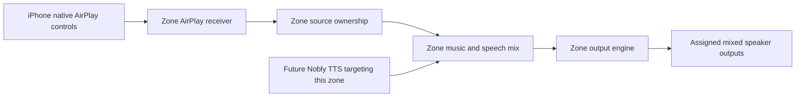

# Shiri production goal

Confirmed by the user on 2026-09-30. This document defines the product to
deliver. An implementation limitation does not remove a requirement.

On 2026-10-01 the user confirmed minimal buffering for music as well as speech,
and clarified that Bluetooth outputs include a speaker-managed group such as
IKEA's newer Bluetooth speakers. Keep that group compatible without requiring
a particular model. The user subsequently excluded Bluetooth phone input;
Bluetooth support here means speaker outputs, including externally linked groups.

The user then explicitly deferred Chromecast **input** for the current release
if no usable open-source receiver could be found. Current research found no
supported stock-phone receiver/provisioning path for this Ubuntu VM. AirPlay 2
input remains required; Chromecast speaker outputs remain supported. Future
Cast input must meet the receiver checks before being enabled. This scope
change supersedes the earlier requirement for both inputs in every zone.

The user's latest instruction separates software completion from later real
world acceptance: finish the implementation, automated review and tests,
including isolated Linux VM and synthetic audio tests, before stopping this
work loop. Stock-phone, microphone and physical-speaker tests will happen
later. Keep those release checks visible, but do not use their deferral to
leave implementable software unfinished or describe untested interoperability
as verified.

On 2026-10-04 the user confirmed the following latency and concurrency policy:

- Load and warm the selected local TTS model when the generation service starts,
  retain it while Shiri runs, and recover it after a worker failure. Keep the
  current native Mac generation and Linux audio runtime deployment.
- Keep every enabled room's assigned speaker connections ready, including after
  long idle periods. This policy favors fast first sound over deepest standby.
- Different rooms must accept different texts and play their replies
  independently. A shared model may serialize inference; room playback must not
  hold that shared generation slot. Bound pending work and retained audio.
- Another reply for an occupied room queues in order within a small per-room
  limit and must not implicitly interrupt it. Nobly
  explicitly identifies the exact job to replace; a stale interruption must
  never cancel a newer reply. Audio already queued by a speaker may have a
  bounded tail, and interruption must not flush or restart music.
- Prioritize time from accepted text to first audible speech throughout model
  scheduling, preparation and delivery. Report measured software stages
  separately from unmeasured speaker/acoustic delay. Preserve complete selected
  output groups and the native phone grouping timeline while reducing overhead.
- Remove obsolete implementation paths, duplicate state and tests of removed
  behavior; preserve distinct routing, continuity, recovery and timing checks.
  Document the resulting architecture and its remaining physical acceptance.

## A zone is a virtual casting destination

An administrator creates a zone, names it, and assigns speakers to it. Every
enabled zone exposes an AirPlay 2 receiver representing that zone and its
assigned speakers. Chromecast input is deferred. A zone can contain a mix of AirPlay, Chromecast, Bluetooth
and wired outputs supported by the installed adapters.

A Bluetooth speaker-managed group is assigned through its main paired speaker.
Shiri treats that exact Bluetooth endpoint as one output. Music, volume and TTS
sent there reach the externally linked group; its members do not become
independently addressable Shiri rooms. Administrators must assign the group to
one zone with the intended announcement audience. Group setup, internal member
synchronization and compatible combinations belong to the speakers. Measure
the complete group path when calibrating it; a membership or mode change can
change its delay and requires a fresh measurement. See
[Bluetooth output and group compatibility](BLUETOOTH_OUTPUT.md).

The listener uses the phone's existing casting controls. No Shiri phone app,
custom sender page, replacement media player, or special development client
is required. The web interface configures and diagnoses the installation; it
is not required to start ordinary phone playback.

An input protocol and an output protocol are separate capabilities. Sending
from OwnTone to a Chromecast speaker does not create a Chromecast receiver
for a phone. A future inbound Cast adapter needs its own validation.

The current API calls its persisted zone records `rooms`; they are the same
configured routing unit. A future Nobly room binding addresses that unit by
an exact external ID. The speaker's native name does not determine which zone
receives TTS.

## Required behavior

1. **Native phone playback.** Each enabled zone appears under its configured
   name in the appropriate phone picker. Selecting it sends the supported
   phone audio to that zone's assigned speakers through native AirPlay controls.
   Publish specific device/app restrictions established by testing.
2. **Zone speaker assignment.** Select outputs once in the administration
   interface. Retain their stable identities, volume settings and calibration
   across restarts and discovery outages. Never route a program to a different
   speaker because the intended output disappeared.
3. **Competing phones.** AirPlay inputs feeding the same zone
   share one explicit music owner. Future protocols must use that same boundary.
   Define a predictable takeover policy and
   enforce it in Shiri; the phones cannot coordinate ownership themselves.
   A stale disconnect or volume callback from the previous source must not
   stop or change its successor. TTS is a separate overlay, not another music
   source competing for that ownership.
4. **Targeted TTS without interrupting music.** TTS can play in any selected
   zone, with or without music. If music is playing, it continues advancing
   normally while Shiri lowers only the music gain and mixes speech over it.
   TTS must not pause, seek, rewind, restart playback, reconnect the outputs,
   or disconnect the phone. Finish, disconnect, cancellation and transport
   failure smoothly restore music gain. No fallback sends speech to another
   zone. Nobly does not exist yet; provide and test its integration boundary
   without inventing a running client.
5. **iPhone grouping.** Preserve the ability to select several Shiri AirPlay 2
   zone receivers in the iPhone's native controls. Verify synchronization at
   the final speaker outputs, including startup, regrouping and long playback.
   Synchronized receiver audio is insufficient if a later relay stage loses
   that timing. Independent OwnTone instances do not establish group sync.
   For example, an iPhone grouping a Bluetooth-backed zone and a Wi-Fi-backed
   zone supplies one shared presentation timeline. Preserve that timeline
   through both relays, use the same declared relay delay in both zones, and
   correct known output delay through their backends. Automated tests must
   exercise independently arriving zone inputs from that common timeline;
   separate successful single-zone tests do not satisfy this requirement.
6. **Mixed output timing.** Keep established backend timing where supported.
   Measure constant delay, jitter and drift for actual output combinations;
   apply per-speaker corrections through the responsible backend. Prefer a
   reproduced backend fix over another unverified speaker scheduler. Report
   measured limits without claiming every mixed connection has equal timing.
7. **Recovery.** Starting, stopping, editing and restarting zones must not
   leak namespaces, audio slots, processes or DHCP resources. Preserve stable
   network identities; verify ownership before cleanup; leave unrelated host
   networking and processes intact. Bound failed requests and retained audio.
8. **Simple operation.** Show saved configuration and actual runtime status
   separately, including which receiver is available, which source owns the
   zone, and whether selected speakers are playing. Provide actionable
   diagnostics, authenticated administration and a tested migration/rollback.

## Production acceptance

These are the current release gates. Physical acceptance follows the software
work at the user's request; Chromecast input is explicitly deferred.

| Gate | Required evidence |
| --- | --- |
| AirPlay input | Stock iPhone discovers each enabled zone and plays through its assigned outputs, without a Shiri phone app |
| Source arbitration | Repeated competing AirPlay sessions have deterministic ownership; stale callbacks cannot alter the winner |
| Native grouping | iPhone selects multiple zone receivers; final outputs remain within an explicitly measured supported tolerance across regrouping/restarts |
| Mixed zone | Available physical AirPlay, Cast, Bluetooth and wired outputs are exercised together, with measured correction/jitter/drift and truthful compatibility |
| TTS routing | Music advances continuously during ducking/overlay; gain restores after completion or failure; idle playback, conflicts and cancellation in at least two zones produce no wrong-zone speech |
| Recovery | Normal cycles, abrupt broker exit, backend failure and network outages preserve intent and release only owned resources |
| Deployment | The actual hardened Linux services, phone interoperability, storage failure behavior and rollback pass; software simulations are supporting evidence |

The candidate already contains AirPlay receiver routing, zone storage and
speaker assignments, an OwnTone output adapter, a TTS mixer, and recovery
work. Complete native multi-zone qualification and the remaining software
matrices are still open. Production replacement also requires the later
physical checks. Chromecast input does not block this release under the revised
scope; any future implementation must pass the stock-phone receiver gates.

See [REBUILD.md](REBUILD.md) for verification and release gates, and
[Cast input scope](CAST_INPUT_FEASIBILITY.md) for the deferred receiver decision.
