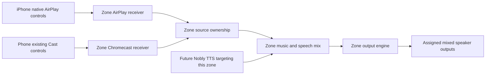

# Shiri production goal

Confirmed by the user on 2026-09-30. This document defines the product to
deliver. An implementation limitation does not remove a requirement.

The user's latest instruction separates software completion from later real
world acceptance: finish the implementation, automated review and tests,
including isolated Linux VM and synthetic audio tests, before stopping this
work loop. Stock-phone, microphone and physical-speaker tests will happen
later. Keep those release checks visible, but do not use their deferral to
leave implementable software unfinished or describe untested interoperability
as verified.

## A zone is a virtual casting destination

An administrator creates a zone, names it, and assigns speakers to it. Every
enabled zone exposes two native phone destinations: an AirPlay 2 receiver and
a Google Cast / Chromecast receiver. Both represent the same zone and its
assigned speakers. A zone can contain a mix of AirPlay, Chromecast, Bluetooth
and wired outputs supported by the installed adapters.

The listener uses the phone's existing casting controls. No Shiri phone app,
custom sender page, replacement media player, or special development client
is required. The web interface configures and diagnoses the installation; it
is not required to start ordinary phone playback.

An input protocol and an output protocol are separate capabilities. Sending
from OwnTone to a Chromecast speaker does not create a Chromecast receiver
for a phone. Shiri must implement and validate both directions.

The current API calls its persisted zone records `rooms`; they are the same
configured routing unit. A future Nobly room binding addresses that unit by
an exact external ID. The speaker's native name does not determine which zone
receives TTS.

## Required behavior

1. **Native phone playback.** Each enabled zone appears under its configured
   name in the appropriate phone picker. Selecting it sends the supported
   phone audio to that zone's assigned speakers. Cast media playback and Cast
   audio/screen streaming are different interoperability cases; both must be
   investigated against the user's request to play audio from existing apps.
   Publish specific device/app restrictions established by testing.
2. **Zone speaker assignment.** Select outputs once in the administration
   interface. Retain their stable identities, volume settings and calibration
   across restarts and discovery outages. Never route a program to a different
   speaker because the intended output disappeared.
3. **Competing phones and protocols.** AirPlay and Cast feeding the same zone
   share one explicit music owner. Define a predictable takeover policy and
   enforce it in Shiri; the phones cannot coordinate ownership themselves.
   A stale disconnect or volume callback from the previous source must not
   stop or change its successor. TTS is a separate overlay, not another music
   source competing for that ownership.
4. **Targeted TTS without interrupting music.** TTS can play in any selected
   zone, with or without music. If music is playing, it continues advancing
   normally while Shiri lowers only the music gain and mixes speech over it.
   TTS must not pause, seek, rewind, restart playback, reconnect the outputs,
   or disconnect the phone. Finish, disconnect, cancellation and transport
   failure smoothly restore music gain. No fallback sends speech to another
   zone. Nobly does not exist yet; provide and test its integration boundary
   without inventing a running client.
5. **iPhone grouping.** Preserve the ability to select several Shiri AirPlay 2
   zone receivers in the iPhone's native controls. Verify synchronization at
   the final speaker outputs, including startup, regrouping and long playback.
   Synchronized receiver audio is insufficient if a later relay stage loses
   that timing. Independent OwnTone instances do not establish group sync.
6. **Mixed output timing.** Keep established backend timing where supported.
   Measure constant delay, jitter and drift for actual output combinations;
   apply per-speaker corrections through the responsible backend. Prefer a
   reproduced backend fix over another unverified speaker scheduler. Report
   measured limits without claiming every mixed connection has equal timing.
7. **Recovery.** Starting, stopping, editing and restarting zones must not
   leak namespaces, audio slots, processes or DHCP resources. Preserve stable
   network identities; verify ownership before cleanup; leave unrelated host
   networking and processes intact. Bound failed requests and retained audio.
8. **Simple operation.** Show saved configuration and actual runtime status
   separately, including which receiver is available, which source owns the
   zone, and whether selected speakers are playing. Provide actionable
   diagnostics, authenticated administration and a tested migration/rollback.

## Production acceptance

These are required gates, not features silently postponed to another product:

| Gate | Required evidence |
| --- | --- |
| AirPlay input | Stock iPhone discovers each enabled zone and plays through its assigned outputs, without a Shiri phone app |
| Chromecast input | Stock phone Cast clients discover each enabled zone, authenticate, start and control the required audio paths; a custom Python sender alone does not pass |
| Source arbitration | Repeated AirPlay-to-Cast and Cast-to-AirPlay contention has deterministic ownership; stale callbacks cannot alter the winner |
| Native grouping | iPhone selects multiple zone receivers; final outputs remain within an explicitly measured supported tolerance across regrouping/restarts |
| Mixed zone | Available physical AirPlay, Cast, Bluetooth and wired outputs are exercised together, with measured correction/jitter/drift and truthful compatibility |
| TTS routing | Music advances continuously during ducking/overlay; gain restores after completion or failure; idle playback, conflicts and cancellation in at least two zones produce no wrong-zone speech |
| Recovery | Normal cycles, abrupt broker exit, backend failure and network outages preserve intent and release only owned resources |
| Deployment | The actual hardened Linux services, phone interoperability, storage failure behavior and rollback pass; software simulations are supporting evidence |

The candidate already contains AirPlay receiver routing, zone storage and
speaker assignments, an OwnTone output adapter, a TTS mixer, and recovery
work. Chromecast input, cross-protocol source arbitration and verified native
multi-zone grouping are missing required capabilities. Until these and the
remaining physical checks pass, this candidate is not the completed product.

See [REBUILD.md](REBUILD.md) for the review loop and actual evidence, and
[RECEIVER_RESEARCH.md](RECEIVER_RESEARCH.md) for inbound receiver evaluation.
