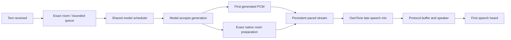

# Architecture and latency review — October 4, 2026

This review and refactor applies to the workspace based on `e56a694` on
`codex/shiri-rebuild`. It changes software, tests and documentation. The review
initially preceded deployment. The subsequent authorized
[rollout](CHECKPOINT_REFACTOR_2026-10-04.md) records actual VM/Mac installation
and quiet checks; no microphone or physical-speaker measurement is added here.

The agreed priority is Nobly text arriving at Shiri → the listener hearing
speech, with independent rooms and uninterrupted music. The implementation now
keeps the selected model resident, defaults enabled outputs to ready, admits
one active reply plus two waiting texts per room, and interrupts only the exact
active job explicitly named by the caller.

## Architectural conclusion

Shiri had avoidable complexity, but the total line count was not its main
latency problem. Native phone receivers, independently programmed rooms, mixed
speaker protocols, exact routing and recovery of privileged Linux resources
are substantial requirements. Removing their ownership boundaries would make
the product less reliable without removing device buffering.

The unnecessary work was concrete: every 20 ms of speech re-entered control
APIs and SQLite; one global job slot serialized independent rooms through
playback; obsolete early mixers and lab generations remained executable;
configuration and calibration state had duplicate representations; and
historical design notes contradicted current behavior. This refactor addresses
those causes while retaining the native output engine and timing contract.

## Changes and evidence

| Previous cause | Current behavior | Evidence / limit |
| --- | --- | --- |
| Global speech job owned the model slot through real-time playback | One inference scheduler; separate per-room playback and FIFO queues | Two-room tests prove overlapping delivery and ordered bounded admission |
| Every frame read a room, opened two Unix RPC connections and encoded JSON/base64 | One authenticated binary stream through each existing broker/worker socket | 150-frame/3-second test opens exactly two connections; service integration performs two room reads total |
| Text admission waited behind unrelated administrative reconciliation | Short coordinator lock and exact route snapshot, rechecked at stream admission | Route/binding change and stale job tests preserve exact routing |
| Model could die while status still claimed ready; successful selection was not durable | Startup preload/warm, persisted selection, process liveness checks and bounded automatic reload | Spawned-process recovery, canceled persistence and failed-load tests |
| Idle output release could add reconnection delay | Enabled rooms default to `ready`, with exact renewable route leases | Readiness renewal/revocation tests; physical standby/power behavior is unmeasured |
| Redundant native readiness read preceded atomic BEGIN | Active music uses BEGIN; idle uses PREPARE→BEGIN; definitive paused not-ready can retry | Native startup/freshness/uncertain-ACK tests retain the admission fence |
| Room loading queried profiles and schema repeatedly per speaker | Two joined SELECTs for list/get/exact Nobly lookup | SQLite statement-count and retained schema-audit tests |
| State and readiness cycles reloaded the same snapshots | One room/health snapshot per cycle, refreshed after relevant phone ACK | Concurrent deletion and exact durable phone-volume receipt checks |
| Calibration cache was written but durable reads always used SQLite | Stateless validation/analysis with SQLite as the owner | Calibration history, revision and cancellation tests |
| UI rebuilt room cards for unrelated or volatile observations | Stable keyed room rendering and independent queued/active speech jobs | Node and real Chromium interaction tests |
| Room interface conflicts could be saved and fail later in the broker | Shared enabled-room LAN constraint enforced in the save transaction | Atomic enable/interface conflict tests |
| Python woke every 10 ms although OwnTone owns sample mixing | 100 ms control heartbeat; first speech media/control remains immediate | Native expiry and music-continuity tests |

Generation buffers are bounded by 60 seconds of mono 48 kHz S16 per active
room, about 5.76 MB plus object overhead. Waiting room jobs store text only.
At most eight rooms and one quiet benchmark can participate; terminal receipt
history is bounded to 32 jobs. This deliberate memory tradeoff lets a faster
than real-time model serve the next room before previous playback ends.

## Correctness repairs

The review examined actual lifetime and race behavior, including cases absent
from the original passing suite:

- **Stale health completion:** room/sender probes now retain the exact launch,
  receiver and client they observed. A delayed success/error cannot overwrite
  or restart a successor.
- **Partial shutdown:** failure releasing a warm hold no longer skips peer,
  native or mixer cleanup. Socket unlink remains inside the worker lock.
- **Repeated cancellation:** owned cleanup joins survive repeated task and
  AnyIO cancellation before propagating the caller's cancellation.
- **Lost stream admission ACK:** the broker registers ownership before awaiting
  downstream admission. An uncertain reply retains the route fence until the
  original launch stops. Only a typed refusal proving no ownership clears that
  attempt. A real two-hop test holds the worker ACK and cancels the caller while
  checking that output reassignment remains blocked.
- **Cross-transport session collision:** a WebRTC request using an active binary
  session ID is rejected before modifying broker bookkeeping. It cannot cancel
  the next PCM frame of an unrelated admitted voice.
- **Model selection cancellation:** atomic file persistence is joined while the
  model lock is held, so late disk writes cannot replace a newer selection or
  disagree with the in-memory selected model.
- **State deletion race:** discovery uses its captured room snapshot, preventing
  one deleted room from failing the entire state response.
- **Oversized numeric input:** option validation checks range before converting
  huge JSON integers to floating point, returning a validation error instead
  of HTTP 500.

Replacement and cancellation retain exact room/job/voice identities. A new
reply cannot implicitly cut off another; a stale interruption cannot cancel a
successor. Audio already queued in a physical device may have a bounded tail.
Speech cleanup never invokes music source revocation or transport flush.

## Removed designs and dependencies

The cleanup removes active alternate implementations, not just their imports:

- GStreamer/raw FIFO mixer, early Python speech mixing/gain envelope and
  synthetic idle music bed.
- Loopback Bluetooth return bridge and its generated bridge configuration.
- Old `--capture`, `--test-source`, `--signal` and no-op `--native` audio modes,
  music hook RPC and JSON `prepare-pcm`/`pcm`/`finish` control transport.
- Unused speech events/overlay tokens in the music source reducer and the
  write-only calibration session cache.
- Duplicate latency policies, historical H750/H1000 startup runners, old
  three/four-second probe branches and the superseded single-fixture matrix.
- Three obsolete AirPlay Loopback demo entrypoints. Useful waveform/capture
  observers now live in small native lab helper modules.
- Tests that asserted removed mixers, retired CLI modes or duplicate policies.
  Synthetic corruption tests now use an explicit independent signal fixture;
  they are not presented as production mixer evidence.
- Duplicate receiver design surveys and long superseded architecture/timing
  narratives. Current docs describe one implementation; dated release records
  retain actual installed identities and rollback evidence.

Production installation, preflight and CI no longer require GStreamer,
PyGObject or an ALSA Loopback card. `SHIRI_INSTALL_LOOPBACK=1` remains an explicit
lab provisioning option for current capture qualification. Real device identity,
SQLite schema migration, exact resource recovery, model input compatibility
and native source/digest guards remain supported behavior, not deprecated code.

Physical line counts include comments and blank lines, compared with `e56a694`.
The application count includes Python, JavaScript, HTML and CSS beneath `shiri`;
test/lab counts include Python, JavaScript tests and native C/header/include
sources beneath `tests`. Generated files and Git-ignored environments are excluded.

| Source area | Before | After | Net change |
| --- | ---: | ---: | ---: |
| Application | 20,374 | 20,567 | +193 |
| Tests and lab code | 87,144 | 80,715 | −6,429 |

Twenty-two obsolete files were removed. New concurrency, persistent transport
and recovery offset the application deletions; its total is almost unchanged.
The test reduction removes retired implementations and duplicate assertions,
while adding coverage of the new queue, transport and cancellation contracts.
The architecture/timing/release docs now describe current behavior instead of
carrying executable instructions for superseded designs.

## What remains on the latency path

The improvement removes avoidable setup, repeated control work and playback
serialization. It does not eliminate model computation, generated leading
silence or speaker rendering delay. The model remains serial during inference;
a room can wait for another generation even though their playback is independent.

The music relay horizon H is not an additional speech delay: speech enters the
late native mix. Text's 300 ms duck attack runs concurrently with its audio.
Qwen's 80 ms generation interval describes audio chunk duration, not a fixed
wall-clock startup sleep. Native speech retains a 20 ms jitter reserve.
Output buffer floors remain 40 ms local/framed Bluetooth, 250 ms Cast/Pulse and
500 ms AirPlay, increased when selected negative offsets require it. Reducing
AirPlay's floor blindly breaks actual receiver timestamp arithmetic. Bluetooth
radio/group buffering and speaker DSP remain additional device effects.

A historical October 3 held-connection example recorded first worker PCM at
74.34 ms and first room admission at 79.15 ms. That approximately 4.8 ms local
difference does not support claiming Python accounted for hundreds of
milliseconds in that request. Neither timestamp measures sound reaching the
listener. The refactor's two-connection test is structural evidence, not a
new acoustic latency benchmark.

Metrics now start at coordinator request entry, before its lock and lookup.
They distinguish admission, room queue, shared generation wait, worker recovery
admission, first PCM, backend preparation, room admission and model retirement.
Mac generation durations and Linux job durations have different origins and
must not be subtracted as if they shared a clock. Full delivery time includes
playing the reply and is not a first-word latency measurement.

## Complexity retained deliberately

Independent OwnTone instances support independently programmed rooms. The
rootless API, privileged broker, separate worker identities and private model
process isolate different resources. Request IDs, source incarnations, room
launches, native flush generations, speech voices and warm leases have different
lifetimes; merging their identities would reintroduce stale-work bugs.

The pinned native patch stack remains the largest maintenance burden outside
the Python application. It is still the reproducible build input, and its
source guards/before-after regressions verify real callback fixes. Squashing
that history into a new backend distribution is a separate packaging change
requiring full native rebuild and installed qualification; it is not needed
for the runtime latency fixes. No new output scheduler, frontend framework or
model framework was introduced.

## Integrated verification

The final full sweeps exercised 4,390 cases on each platform. Both exposed the
same ten stale test expectations: one whole-file fingerprint of a retired lab
design and nine calls to the removed JSON PCM interface. The fingerprint was
replaced by the existing specific daemon-identity contract, and the duck tests
now exercise owned stream admission, raw PCM and exact retirement. No production
code changed after these sweeps. Both repaired files were then rerun in full;
the remaining passing cases are unchanged.

| Check | Result |
| --- | --- |
| macOS / Python 3.12 full sweep | 4,303 passed, 77 skipped; the ten stale expectations above were the only failures |
| macOS repaired test files | 45 passed, including all ten repaired cases |
| Related native speech/duck/transport checks | 153 passed after fixture adaptation |
| Isolated Ubuntu 22.04 ARM64 / Python 3.10.12 full sweep | 4,369 passed, 11 skipped; the same ten stale expectations were the only failures |
| Linux repaired test files | 45 passed, including all ten repaired cases |
| Six explicit CI native checkers | Passed with sanitizers: source transition, native anchor, packet timestamps, framed output, ALSA partial writes and BlueALSA drop synchronization |
| Node and opt-in Chromium browser tests | 76 passed |
| Ruff, shell syntax, offline dependency-lock consistency, whitespace and documentation links | Passed |

Linux skips are four explicit private-credential/lifecycle opt-ins, six offline
wheelhouse checks and one unavailable optional spaCy asset. That environment
has neither PyGObject nor GStreamer installed, verifying the simplified runtime
dependency set. Focused evidence above covers actual contracts; a passing suite
alone is not the architectural conclusion.

Across the full sweeps and repaired-file reruns, all 4,313 non-skipped Mac cases
and 4,379 non-skipped Linux cases passed. Full logs are retained locally at
`/tmp/shiri-refactor-macos-final.log`, `/tmp/shiri-review-linux-verified.log`,
`/tmp/shiri-review-linux-repaired.log` and `/tmp/shiri-refactor-web-final.log`.
The first two logs retain the initial stale-test failures for traceability.
Native checker metadata reports maintained patch/adapter seams rather than a
full installed source build; real FFmpeg and SBC libraries were exercised.

The isolated Linux environment has no host audio devices, privileged host
access or live room services. It exercises Linux-specific software and
Python 3.10 compatibility, not the installed systemd/network boundary or
physical speakers. The subsequent live installation and quiet smoke checks are
recorded separately in [the deployment checkpoint](CHECKPOINT_REFACTOR_2026-10-04.md).
[Release verification](REBUILD.md) and [product acceptance](PRODUCT_REQUIREMENTS.md)
identify the later hardware checks; [architecture](ARCHITECTURE.md) and
[local TTS](LOCAL_TTS.md) document the resulting implementation.
