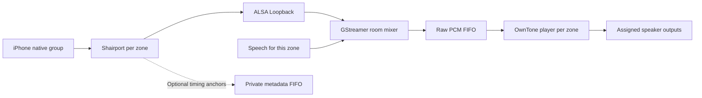

# Preserving native group timing through Shiri

Research checkpoint: 2026-09-30. Native iPhone selection of multiple Shiri
AirPlay 2 zones is required existing behavior. The final assigned speakers must
retain that group's synchronization through capture, mixing and delivery. This
is an unresolved production requirement, not an accepted deferred exclusion.
See [PRODUCT_REQUIREMENTS.md](PRODUCT_REQUIREMENTS.md) for the authoritative
behavior and [CALIBRATION.md](CALIBRATION.md) for acoustic measurement methods.

The initial audit below identifies the timing lost by the original raw-PCM
relay. The candidate now implements the corresponding timestamp-preserving
Shairport/OwnTone patches, exact source ownership and native mixer; actual C
checks and a fresh Ubuntu backend build have passed. Whole-path multi-zone
Linux output validation is in progress. No result here establishes physical
speaker alignment or stock-phone compatibility. Chromecast input is deferred
by the user for this release; Chromecast speaker outputs remain in scope.

## Candidate buffering and speaker compensation

The current low-latency candidate computes each room's OwnTone buffer `B` as
the maximum of 500 ms and each selected speaker's required lead minus its
offset. AirPlay 1/2 use a 500 ms candidate lead; wired, Bluetooth and Cast use
250 ms. Ordinary rooms still use B500. A selected −2000 ms correction therefore
requires B2500 for AirPlay and B2250 for the other routes. An unused correction
range no longer charges every room the largest buffer. Configuration rejects a
selected correction that would leave less than its route's required lead. This preserves
the earlier repair: a fixed 500 ms buffer silently ignored offsets below −500 ms
in the ALSA session constructor. AirPlay's separate source guard requires the
base to exceed 250 ms. Physical devices may impose a larger buffer even when that
guard passes; only later device measurements can establish their minimum.
[Pinned configuration default](https://github.com/owntone/owntone-server/blob/d6fb3edf5831de38134ebd92fcf09a730ddd37aa/src/conffile.c),
[pinned ALSA session timing](https://github.com/owntone/owntone-server/blob/d6fb3edf5831de38134ebd92fcf09a730ddd37aa/src/outputs/alsa.c),
[pinned AirPlay buffer interpretation](https://github.com/owntone/owntone-server/blob/d6fb3edf5831de38134ebd92fcf09a730ddd37aa/src/outputs/airplay.c)

The October 1 actual-source receiver audit exposed a further boundary that
the policy tests did not cover. OwnTone's AirPlay 2 timestamp encoders and
the pinned Shairport PTP consumer leave `B + offset − 250 − 150` milliseconds
for this receiver's native backend. B500/offset0 gives 100 ms; both
B500/offset−250 and B2250/offset−2000 give −150 ms, which the consumer stores
as a large unsigned sample count. The preceding universal 250 ms correction
margin was therefore invalid for this route. The route-aware correction now
retains a 100 ms window at every admitted AirPlay offset. Exhaustive extracted-C
checks cover all 4,001 integer offsets and preserve the reproduced old-policy
failure. Applying the same candidate lead to AirPlay 1 is conservative; it is
not a measured device profile. Actual output measurements remain required
before releasing negative offsets.
The extracted C proof is retained by `/tmp/shiri-route-buffer-audit.py`;
it exercises the maintained packet encoders and consumer statements rather
than assuming a universal speaker buffer.

For a native source frame with mapped phone presentation time `P`, the mixer
envelope carries `P + H`. The broker freezes one common `H` for all enabled zones:
the largest configured `B` plus 500 ms startup headroom. Ordinary zones therefore
use a 1000 ms relay candidate, replacing the rebuild's conservative four seconds.
The largest admitted negative correction raises H to 3000 ms for AirPlay or
2750 ms for the other routes; it does not change ordinary rooms' buffer policy.
The framed input supplies OwnTone's existing player with `P + H − B`; the output
adds `B + offset`, retaining final `P + H + offset` across different room buffers.
The first player anchor must remain in the future; a late native packet is never
rebased to receive time. These candidate values require cold/warm final-output
measurements before release. Administrative plan changes retire old program
incarnations; TTS never changes this plan.

Speech uses a separate room/launch/UID-bound datagram channel into OwnTone's
player immediately before `outputs_write`, after the player has waited for the
program anchor. It avoids the music relay queue and uses the existing output
lead. The queue and packet age are bounded to 250 ms, gain ramps are 40 ms down
and 250 ms up, and ordinary speech EOF drains valid queued samples. Idle speech
starts a short timed silence bed rather than waiting through `H`. Actual cold
device startup and any additional AirPlay, Cast, Bluetooth or hardware buffering
remain separate measurement obligations. Speech never pauses, seeks, restarts
music or invokes a source flush.

The [actual-source regression](../tests/native/check_common_buffer.py) sends a
timestamped packet through the patched reader using a real private pipe, then
executes the maintained ALSA session-delay guard and final timestamp assignment.
It derives `B` from a generated profile with a selected −2000 ms correction and
verifies all 4001 integer offsets without a discarded correction. The exact
unqualified 500 ms preimage fails 1500 negative
offset cases. This is backend scheduling evidence; it does not establish
acoustic alignment or measure a physical speaker's latency. Cast still adds its
own 100 ms transport allowance and lacks proven precise final presentation;
using the same base buffer does not remove transport jitter or drift.

## Explicit minimum music buffer experiment

A separate opt-in plan now tests a route-specific minimum instead of charging
local outputs the AirPlay lead. The production default above and the original
H750/B500 MUSIC experiment remain unchanged during qualification.

| Selected output route | Candidate lead after its correction | Zero-offset B | Single-room H |
| --- | ---: | ---: | ---: |
| Pinned ALSA or private framed Bluetooth A2DP | 40 ms | 40 ms | 140 ms |
| Cast or unqualified Pulse route | 250 ms | 250 ms | 350 ms |
| AirPlay 1/2 | 500 ms | 500 ms | 600 ms |

Forty milliseconds is two production 20ms PCM periods and four OwnTone 10ms
playback ticks. The maintained ALSA/framed-output path does not impose the
previous Python 500ms floor. It remains a software candidate: a Bluetooth
speaker or a speaker group may add buffering that Shiri cannot remove. A
vendor-linked Bluetooth group is assigned as its one A2DP output endpoint;
its internal speaker alignment requires the later physical measurements.

For each enabled room, the minimum plan selects B at least 40ms and at least
every selected route's lead minus its saved offset. It freezes one common
H=max(enabled B)+100ms. Mixed endpoints therefore retain their separate
constraints; an AirPlay endpoint never inherits the local40ms allowance. A
selected −2000ms local correction uses B2040; the same AirPlay correction
requires B2500. Disabled rooms do not increase a running plan's horizon.

With original receiver P 150ms after nominal first availability, the
largest-buffer room's first OwnTone read anchor P+H−B has 250ms from that
availability. Actual output START and source admission must finish before the
original anchor. The fresh post-peek clock check refuses an equal or expired
anchor; it never rebases P or skips the first frame. H0 is still refused and
requires a separately proven earlier receiver delivery/preparation design.

`run_native_music_minimum.py` is a distinct explicit cold H140/B40 experiment
with its own version 2 producer profile and result artifacts. It retains the
immutable calendar published before either BEGIN, the unchanged 150ms delivery
lateness bound, the exact 21s lossless prefix/body/tail oracle, 2ms group/drift
limits, independently measured absolute capture horizon, original source/unit
ownership, advancing NPT, zero drops, and complete output/unit cleanup.
Controlled actual OwnTone C timer/timerfd fixtures cover the 250ms admission
boundaries; they do not measure hardware START duration. The complete Linux
MUSIC path and later physical route measurements must pass before default
production policy is promoted.

The October 1 repeat retained both complete21-second outputs but measured a
steady4ms relative offset with no drift. Original waveform/timestamp replay
reproduces that failure; the2ms acceptance limit remains unchanged. OwnTone's
existing ALSA correction leaves small fixed offsets with zero drift alone,
so this observation does not identify which component created the first skew.
The test instrument is being checked independently: upstream Linux5.15's
loopback driver defaults to a jiffies timer, saves a jiffies position when each
stream starts and rounds period scheduling to ticks. Actual kernel configuration,
driver timer selection, cable state and monotonic playback-trigger observations
are needed before attributing the measured offset to Shiri or the fixture.
This is a hypothesis, not an established cause or a backend timing correction.
[Linux5.15 loopback driver](https://github.com/torvalds/linux/blob/v5.15/sound/drivers/aloop.c)

Actual68 subsequently recorded `/proc/asound/timers` with a4000µs system timer
and all `snd_aloop` timer-source entries unset. These observations support the
fixture's coarse-timer hypothesis; they do not explain which startup created
the65 offset. The initial64KiB kernel-config read was explicitly rejected as
oversized, so it provides no `CONFIG_HZ` evidence. The next read-only observer
uses a bounded1MiB config read and retains the actual playback trigger/cable
state without changing the original2ms waveform acceptance limit.

Actual69/71 retained the unchanged current-backend H140/B40 experiment and
original PCM/timestamps. Full, early and late waveform replay each measured
+4ms relative offset with zero drift, while the earlier65 run measured−4ms.
The observer confirmed `CONFIG_HZ_250=y`, `CONFIG_HZ=250` and high-resolution
timer support. Both loopback cables still used the system timer. Playback
trigger values differed by about1ms, but their timestamp clock type was not
reported; comparing those values directly with the source calendar would be
unqualified. No acceptance limit or production scheduling correction changed.

Linux5.15 also exposes a writable per-card `timer_source` proc entry. A new
loopback cable selects that card's current timer source when it opens; the
module's initial parameter alone does not describe a later proc selection.
The external PCM-timer branch also requires matching playback and capture
periods and checks the timer resolution against those periods. Current
playback uses512 frames and capture uses960; a small-period dummy PCM timer
is therefore not a drop-in replacement. Later isolated experiments195–197
selected a dummy48-frame clock after explicitly admitting that test variant;
they did not change production audio. Experiment195 exposed close-time proc
write application,196 exposed an invalid timestamp-freshness assumption, and
197 measured18.13ms of independent Loopback baseline dispersion despite a
stable dummy clock. The external timer path can lose elapsed progress when
callbacks batch; the retained observations do not distinguish its two callback
stages. Every failed result remains retained, and the original blank timer and
module state were restored before the next experiment.
[Linux5.15 timer-source selection](https://github.com/torvalds/linux/blob/v5.15/sound/drivers/aloop.c)

An alternative isolated experiment uses the official Ubuntu ARM64 lowlatency
kernel at the same5.15.0-194 revision. The two downloaded kernel packages match
the previously verified signed archive index; their extracted configuration
declares `CONFIG_HZ_1000=y`, `CONFIG_HZ=1000` and high-resolution timers. This
tests the coarse-clock hypothesis while preserving the512/960 geometry.
Actual198 booted that already-installed official kernel for one boot, using
stock Loopback's default timer. Fresh observation confirms the1000Hz config,
same VM and exact application/native/settings/rollback postimages; the generic
kernel remains the unchanged GRUB default. No kernel backport was installed.
Finite198 passed its independent baselines but stopped when the48-frame test
variant contradicted the finite fixture's original960-frame contract. Its full
failure and successful cleanup are retained. Finite200 now uses the complete
byte-identical original182 fixture tree and freshly admitted boot identity.
It passed both idle/native finite utterances, the unchanged2ms configured-offset
and drift checks, complete prefix/body/codec-tail/quiet and all cleanup, followed
by fresh original182 admission. Its independent queue-origin spreads were below
1ms. It lacked the required prelaunch budget binding; its original report
deliberately leaves speech performance unqualified. Separately declared202
zero and +2000ms cold/warm idle/native cases passed, while the native −2000ms
startup assertion failed. Diagnostic203 conclusively observed PCM at about
P+140ms while the negatively corrected target's API reported PAUSED/master100 and
the same positive item; API PLAYING appeared at about P+2151ms with unchanged
source and advancing blocks. That intentional diagnosticFAIL and its original
capture-tail errors remain retained.

The one-file204 test correction permits only this bounded initial negative-target
buffering state, preserving source/item/volume identity and the original waveform,
2ms alignment/drift and cleanup requirements. It changes no production package,
native backend or buffer. A fresh204 profile and pre-source declaration bind
all six required cases: all three cold/warm idle/native offset pairs passed with
full cleanup and post-admission. The unchanged frozen evaluator qualified all
12 software latency rows, preserving each original report and the complete
independent timestamp bracket. Original202 passes were not used to qualify the
differently admitted204 profile. Default-buffer promotion and physical/phone
acceptance remain separate.

Actual205 subsequently returned to the unchanged stock generic kernel and
passed fresh exact candidate182 admission. Encrypted199 passed playback,
playing/paused/idle speech, volume and manager reload with complete cleanup on
that boot. It is a functional regression, not a repeat of the204 latency matrix.
Both exact installation rollbacks and normal VM shutdown then passed, preserving
the protected live VM and original images.
A finer kernel alone does not establish synchronization; the unchanged
2ms waveform gate, complete PCM/calendar checks and fallback/rollback checks
must pass before any minimum policy is promoted. Local package/config evidence
is retained in `/tmp/shiri-lowlatency-kernel-config-review-result.json`.

## Reviewed revisions and original relay

The reviewed OwnTone commit is
`d6fb3edf5831de38134ebd92fcf09a730ddd37aa`. The relevant input, player, AirPlay
output and configuration sources are byte-identical to the corresponding 29.3
tag files. Shairport is pinned to
`7bad231c18368dbd26f298577f6210e36e4b0797`. Installation pins are recorded in
[build_backends.sh](../install/build_backends.sh); a different build requires
rechecking these conclusions.

The release API was rechecked on 2026-09-30: the latest stable releases are
[OwnTone 29.3, published July 22](https://github.com/owntone/owntone-server/releases/tag/29.3)
and [Shairport Sync 5.5.2, published September 14](https://github.com/mikebrady/shairport-sync/releases/tag/5.5.2).
The candidate uses these pinned releases with reviewable local patches.

The original receiver has sender-derived timing. In the audited configuration it feeds
48 kHz stereo S16LE into ALSA Loopback. The music capture source does not provide
the mixer clock. Each worker starts its own live pipeline and uses pipeline
running time for speech. The output callback extracts buffer bytes, discarding
Gst PTS, duration and discontinuity information. Nonblocking FIFO writes drop
complete stereo frames when the reader is absent or full; downstream receives
no marker identifying the missing time. These properties bound memory but
cannot preserve a source presentation timeline by themselves.
[Current mixer and FIFO](../shiri/runtime/audio.py)

The Shairport start hook activates the mixer before receiver playback begins.
Its live silence bed can therefore reach OwnTone's pipe autostart before music
arrives. Whether the resulting start phase differs between zones is an
experiment question. Equal configured buffering does not answer it.
[Current receiver and OwnTone configuration](../shiri/runtime/configuration.py)

OwnTone's pipe module reads raw PCM and forwards quality/metadata markers. It
does not send `INPUT_FLAG_SYNC`. Its Shairport metadata parser accepts progress,
volume, artwork, track metadata and flush messages, but ignores `phb0`/`phbt`.
The player initializes its timestamp from its first read using
`CLOCK_MONOTONIC`, advances it with samples/ticks, and resets the session clock
on resume after suspension. Thus a shared receiver clock is not retained across
the raw FIFO/player boundary. Sharing a LAN namespace or PTP daemon does not
give those independent players a common source frame-to-time association.
[Pinned pipe input](https://github.com/owntone/owntone-server/blob/d6fb3edf5831de38134ebd92fcf09a730ddd37aa/src/inputs/pipe.c),
[pinned player](https://github.com/owntone/owntone-server/blob/d6fb3edf5831de38134ebd92fcf09a730ddd37aa/src/player.c)

## Receiver provenance available for investigation

The pinned Shairport configuration documents optional `phb0`/`phbt` progress
anchors: an RTP frame position and its intended local presentation time in
nanoseconds. They are emitted when audio enters the backend buffer, ahead of
presentation. On Linux their clock is `CLOCK_MONOTONIC_RAW`, with
`CLOCK_MONOTONIC` as the documented fallback. Current Shiri metadata is enabled
in a private FIFO, but `progress_interval` is unset and no timing consumer is
implemented. Merely attaching this metadata to OwnTone's audio pipe would not
make its current parser use those anchors.
[Pinned anchor specification](https://github.com/mikebrady/shairport-sync/blob/7bad231c18368dbd26f298577f6210e36e4b0797/scripts/shairport-sync.conf),
[anchor emission](https://github.com/mikebrady/shairport-sync/blob/7bad231c18368dbd26f298577f6210e36e4b0797/player.c)

For AirPlay 2 PTP streams, Shairport reads `groupUUID` and
`groupContainsGroupLeader` from RTSP SETUP and retains them on the connection.
It exposes group-related `gid`/`gcgl` discovery properties. These are concrete
source-identity hooks, but the current PCM transport has no associated group
identity. Observe actual stock-phone changes rather than deduplicating streams
by track title, matching waveform or source IP.
[Pinned group handling](https://github.com/mikebrady/shairport-sync/blob/7bad231c18368dbd26f298577f6210e36e4b0797/rtsp.c)

The ALSA output callback receives RTP timestamp and presentation-time
parameters but does not transport them with PCM. Shairport's existing delay
reporting still participates in receiver synchronization; `use_precision_timing
= "no"` does not mean synchronization is disabled. Capture after ALSA, rate
conversion and sample correction cannot be assumed to preserve an exact
one-to-one RTP frame index. An experimental receiver output adapter must carry
the actual PCM-to-source association at a defined boundary, including any
skipped, inserted or converted samples.
[Pinned ALSA backend](https://github.com/mikebrady/shairport-sync/blob/7bad231c18368dbd26f298577f6210e36e4b0797/audio_alsa.c)

## Mapping clocks without creating a speaker scheduler

`CLOCK_MONOTONIC` is adjusted incrementally by NTP/adjtime;
`CLOCK_MONOTONIC_RAW` is not. Their values are not interchangeable even on one
host. Both omit suspended time on Linux. A proposed adapter can sample a RAW
read between two MONOTONIC reads: the bracket gives an uncertainty interval;
its midpoint supplies an initial offset estimate. Repeated samples support a
local mapping `monotonic ~= a * raw + b`, with a measured residual and expiry.
This is an experiment method, not a validated implementation. Refresh rather
than assuming one startup offset lasts indefinitely; invalidate stale mappings
after process restart, suspend or a detected change. If clocks belong to
different machines, these local paired reads cannot establish their relation.
[Linux clock semantics](https://man7.org/linux/man-pages/man3/clock_gettime.3.html)

GStreamer PTS is interpreted with segment information as pipeline running time;
the pipeline base time relates that running time to its selected clock. Record
the selected clock and base time, and handle segment changes. PTS alone is not
an absolute source presentation deadline, and two independently started
pipelines do not have equal base times by definition.
[GStreamer clocks and running time](https://gstreamer.freedesktop.org/documentation/application-development/advanced/clocks.html)

The shared timeline means a source frame has one intended presentation time
that survives every room's relay. It does not require room mixes to be
identical: targeted speech and ducking may differ while the common music keeps
advancing. Receiver and output backends should retain responsibility for their
established timing. Clock conversion and provenance transport do not justify
adding an unverified per-speaker scheduler around OwnTone.

## A bounded OwnTone fork experiment

OwnTone already defines `ts_get` and `INPUT_FLAG_SYNC`. Its input layer places a
sync marker at the beginning of the associated PCM write; the player consumes
that marker through `event_read_ts` and updates its output timestamp. No reviewed
input module implements the hook. A framed input adapter is therefore a
specific candidate seam, not a feature available through current raw pipes.
[Pinned input definition](https://github.com/owntone/owntone-server/blob/d6fb3edf5831de38134ebd92fcf09a730ddd37aa/src/input.h),
[sync marker handling](https://github.com/owntone/owntone-server/blob/d6fb3edf5831de38134ebd92fcf09a730ddd37aa/src/input.c)

The AirPlay output treats the player's timestamp as its clock reference and
calculates which output RTP position corresponds to that time, accounting for
output buffering. It is not simply the acoustic deadline of the first sample
in an incoming block. The fork must derive and test that relationship; blindly
putting a Shairport anchor into `ts_get` is insufficient. Buffer availability,
playback tick phase and suspension/restart behavior also need validation.
[Pinned AirPlay timestamp interpretation](https://github.com/owntone/owntone-server/blob/d6fb3edf5831de38134ebd92fcf09a730ddd37aa/src/outputs/airplay.c)

The proposed experiment sequence is:

1. Instrument the unchanged baseline in an isolated test installation. Record
   receiver anchors/group changes, mixer timing and FIFO drop counters alongside
   OwnTone starts, underruns and resumes. Instrumentation must stay bounded and
   must not add a second consuming FIFO reader or block live audio callbacks.
2. Define a versioned PCM envelope with room/source identity, native group UUID,
   session/flush generation, sequence/frame index, format/sample count,
   presentation time with clock domain, and explicit gap/end markers. Reject
   oversized, malformed, stale-generation and unsupported-format frames. Keep
   original timing and the clock-mapping evidence for diagnosis.
3. Prototype an experimental Shairport output boundary and OwnTone input module
   against the pinned revisions. Preserve source/frame provenance through rate
   conversion and mixing, translate the measured clock domain, and exercise the
   existing OwnTone timestamp/output path. Retain existing backend timing and
   bounded backpressure; do not implement another speaker delivery controller.
4. Use deterministic fixtures to test equal source deadlines with deliberately
   unequal process starts, delayed blocks, gaps, stale frames, flush/regrouping
   and restart. Compare final backend output timing, not just accepted envelope
   values or healthy processes.
5. Repeat the stock-phone and physical-output experiment below. Pin a fork only
   if it measurably improves the failing stage and retains control, ownership,
   cleanup, independent-zone playback and targeted speech behavior.

One common player for grouped outputs is another candidate, but OwnTone's
ordinary output set receives a common PCM program. That alone cannot produce
speech only in one grouped zone, or duck only that zone's music. A design that
solves grouping by broadcasting TTS to every grouped output fails the product.
Any shared-player design needs a proven room-specific mix/output boundary;
otherwise preserve separate room mixes on the shared source timeline.

## Required native-phone and final-output experiment

Use a stock iPhone's native multi-destination controls, two named Shiri zone
receivers, disjoint assigned outputs and an identifiable repeated probe played
through an existing phone app. Record phone/OS/app and backend versions. A
Python sender, two manual starts or a synthetic shared buffer can isolate a
component but cannot pass native grouping acceptance.

Capture receiver audio, mixer output and final outputs at identifiable probe
markers. For acoustic comparison, use simultaneous microphone/line channels
sharing one ADC clock, with documented geometry and processing. Software taps
need their own measured clock relation and must not change the playback path's
reader/backpressure behavior. A good receiver capture is evidence about that
stage only; final acoustic timing remains the acceptance result.

Cover cold group startup, adding/removing/readding a zone, pause/resume, seeking,
sender takeover, one backend reconnect, representative network/CPU load and at
least 30 minutes of repeated markers. Run repeated restarts and retain failed
or rejected takes. Report per-stage relative lag, startup variation, jitter,
drift, gaps and correlated backend events using the methods in
[CALIBRATION.md](CALIBRATION.md). Define the supported tolerance before calling
the result synchronized.

During grouped music, inject speech only into zone A. Verify speech is absent
from zone B, A's music ducks and smoothly restores, and the music marker/frame
sequence in both zones continues advancing without seek, pause, playback
restart, output reconnection or phone disconnection. Then remove A from the
group and play different programs independently. Late metadata, frames and
callbacks from the old group/session must not alter either successor.

## Actual backend configuration parsing

The regular-expression listener tests check intended values, not OwnTone's
grammar. They initially accepted `port = 0;`, which the actual Linux backend
rejected. Keep those semantic guards and add real parser evidence. Parameterize
the dedicated actual-backend Linux harness over default, escaped-name and
BlueALSA-generated configurations; require clean startup/cleanup for valid
fixtures and parser rejection for the semicolon mutation.

OwnTone's undocumented CI `-t`/`--testrun` loads configuration, initializes its
services, then skips the main event loop and shuts down. It is not a side-effect
free configuration validator. Use an isolated test installation and namespace
if exercising it. A separate pinned `--check-config` entry point that calls
the existing configuration loader and exits before service/resource setup is
a possible small future fork addition for inexpensive parser-only CI. Neither
that option nor a production fork is implemented by this research checkpoint.
[Pinned startup/testrun](https://github.com/owntone/owntone-server/blob/d6fb3edf5831de38134ebd92fcf09a730ddd37aa/src/main.c),
[configuration loader](https://github.com/owntone/owntone-server/blob/d6fb3edf5831de38134ebd92fcf09a730ddd37aa/src/conffile.c)
