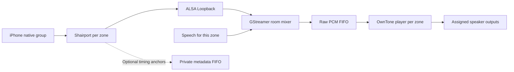

# Preserving native group timing through Shiri

Research checkpoint: 2026-09-30. Native iPhone selection of multiple Shiri
AirPlay 2 zones is required existing behavior. The final assigned speakers must
retain that group's synchronization through capture, mixing and delivery. This
is an unresolved production requirement, not an accepted deferred exclusion.
See [PRODUCT_REQUIREMENTS.md](PRODUCT_REQUIREMENTS.md) for the authoritative
behavior and [CALIBRATION.md](CALIBRATION.md) for acoustic measurement methods.

This review identifies a concrete loss of timing provenance and an experiment
boundary. It does not establish an acoustic failure magnitude, implement an
OwnTone fork, or prove that a proposed transport fixes grouping. Chromecast
input remains a separate required receiver implementation and acceptance gate.

## Reviewed revisions and current path

The reviewed OwnTone commit is
`d6fb3edf5831de38134ebd92fcf09a730ddd37aa`. The relevant input, player, AirPlay
output and configuration sources are byte-identical to the corresponding 29.3
tag files. Shairport is pinned to
`7bad231c18368dbd26f298577f6210e36e4b0797`. Installation pins are recorded in
[build_backends.sh](../install/build_backends.sh); a different build requires
rechecking these conclusions.

The receiver has sender-derived timing. In the current configuration it feeds
48 kHz stereo S16LE into ALSA Loopback. The music capture source does not provide
the mixer clock. Each worker starts its own live pipeline and uses pipeline
running time for speech. The output callback extracts buffer bytes, discarding
Gst PTS, duration and discontinuity information. Nonblocking FIFO writes drop
complete stereo frames when the reader is absent or full; downstream receives
no marker identifying the missing time. These properties bound memory but
cannot preserve a source presentation timeline by themselves.
[Current mixer and FIFO](../shiri/runtime/audio.py)

The Shairport start hook activates the mixer before receiver playback begins.
Its live silence bed can therefore reach OwnTone's pipe autostart before music
arrives. Whether the resulting start phase differs between zones is an
experiment question. Equal configured buffering does not answer it.
[Current receiver and OwnTone configuration](../shiri/runtime/configuration.py)

OwnTone's pipe module reads raw PCM and forwards quality/metadata markers. It
does not send `INPUT_FLAG_SYNC`. Its Shairport metadata parser accepts progress,
volume, artwork, track metadata and flush messages, but ignores `phb0`/`phbt`.
The player initializes its timestamp from its first read using
`CLOCK_MONOTONIC`, advances it with samples/ticks, and resets the session clock
on resume after suspension. Thus a shared receiver clock is not retained across
the raw FIFO/player boundary. Sharing a LAN namespace or PTP daemon does not
give those independent players a common source frame-to-time association.
[Pinned pipe input](https://github.com/owntone/owntone-server/blob/d6fb3edf5831de38134ebd92fcf09a730ddd37aa/src/inputs/pipe.c),
[pinned player](https://github.com/owntone/owntone-server/blob/d6fb3edf5831de38134ebd92fcf09a730ddd37aa/src/player.c)

## Receiver provenance available for investigation

The pinned Shairport configuration documents optional `phb0`/`phbt` progress
anchors: an RTP frame position and its intended local presentation time in
nanoseconds. They are emitted when audio enters the backend buffer, ahead of
presentation. On Linux their clock is `CLOCK_MONOTONIC_RAW`, with
`CLOCK_MONOTONIC` as the documented fallback. Current Shiri metadata is enabled
in a private FIFO, but `progress_interval` is unset and no timing consumer is
implemented. Merely attaching this metadata to OwnTone's audio pipe would not
make its current parser use those anchors.
[Pinned anchor specification](https://github.com/mikebrady/shairport-sync/blob/7bad231c18368dbd26f298577f6210e36e4b0797/scripts/shairport-sync.conf),
[anchor emission](https://github.com/mikebrady/shairport-sync/blob/7bad231c18368dbd26f298577f6210e36e4b0797/player.c)

For AirPlay 2 PTP streams, Shairport reads `groupUUID` and
`groupContainsGroupLeader` from RTSP SETUP and retains them on the connection.
It exposes group-related `gid`/`gcgl` discovery properties. These are concrete
source-identity hooks, but the current PCM transport has no associated group
identity. Observe actual stock-phone changes rather than deduplicating streams
by track title, matching waveform or source IP.
[Pinned group handling](https://github.com/mikebrady/shairport-sync/blob/7bad231c18368dbd26f298577f6210e36e4b0797/rtsp.c)

The ALSA output callback receives RTP timestamp and presentation-time
parameters but does not transport them with PCM. Shairport's existing delay
reporting still participates in receiver synchronization; `use_precision_timing
= "no"` does not mean synchronization is disabled. Capture after ALSA, rate
conversion and sample correction cannot be assumed to preserve an exact
one-to-one RTP frame index. An experimental receiver output adapter must carry
the actual PCM-to-source association at a defined boundary, including any
skipped, inserted or converted samples.
[Pinned ALSA backend](https://github.com/mikebrady/shairport-sync/blob/7bad231c18368dbd26f298577f6210e36e4b0797/audio_alsa.c)

## Mapping clocks without creating a speaker scheduler

`CLOCK_MONOTONIC` is adjusted incrementally by NTP/adjtime;
`CLOCK_MONOTONIC_RAW` is not. Their values are not interchangeable even on one
host. Both omit suspended time on Linux. A proposed adapter can sample a RAW
read between two MONOTONIC reads: the bracket gives an uncertainty interval;
its midpoint supplies an initial offset estimate. Repeated samples support a
local mapping `monotonic ~= a * raw + b`, with a measured residual and expiry.
This is an experiment method, not a validated implementation. Refresh rather
than assuming one startup offset lasts indefinitely; invalidate stale mappings
after process restart, suspend or a detected change. If clocks belong to
different machines, these local paired reads cannot establish their relation.
[Linux clock semantics](https://man7.org/linux/man-pages/man3/clock_gettime.3.html)

GStreamer PTS is interpreted with segment information as pipeline running time;
the pipeline base time relates that running time to its selected clock. Record
the selected clock and base time, and handle segment changes. PTS alone is not
an absolute source presentation deadline, and two independently started
pipelines do not have equal base times by definition.
[GStreamer clocks and running time](https://gstreamer.freedesktop.org/documentation/application-development/advanced/clocks.html)

The shared timeline means a source frame has one intended presentation time
that survives every room's relay. It does not require room mixes to be
identical: targeted speech and ducking may differ while the common music keeps
advancing. Receiver and output backends should retain responsibility for their
established timing. Clock conversion and provenance transport do not justify
adding an unverified per-speaker scheduler around OwnTone.

## A bounded OwnTone fork experiment

OwnTone already defines `ts_get` and `INPUT_FLAG_SYNC`. Its input layer places a
sync marker at the beginning of the associated PCM write; the player consumes
that marker through `event_read_ts` and updates its output timestamp. No reviewed
input module implements the hook. A framed input adapter is therefore a
specific candidate seam, not a feature available through current raw pipes.
[Pinned input definition](https://github.com/owntone/owntone-server/blob/d6fb3edf5831de38134ebd92fcf09a730ddd37aa/src/input.h),
[sync marker handling](https://github.com/owntone/owntone-server/blob/d6fb3edf5831de38134ebd92fcf09a730ddd37aa/src/input.c)

The AirPlay output treats the player's timestamp as its clock reference and
calculates which output RTP position corresponds to that time, accounting for
output buffering. It is not simply the acoustic deadline of the first sample
in an incoming block. The fork must derive and test that relationship; blindly
putting a Shairport anchor into `ts_get` is insufficient. Buffer availability,
playback tick phase and suspension/restart behavior also need validation.
[Pinned AirPlay timestamp interpretation](https://github.com/owntone/owntone-server/blob/d6fb3edf5831de38134ebd92fcf09a730ddd37aa/src/outputs/airplay.c)

The proposed experiment sequence is:

1. Instrument the unchanged baseline in an isolated test installation. Record
   receiver anchors/group changes, mixer timing and FIFO drop counters alongside
   OwnTone starts, underruns and resumes. Instrumentation must stay bounded and
   must not add a second consuming FIFO reader or block live audio callbacks.
2. Define a versioned PCM envelope with room/source identity, native group UUID,
   session/flush generation, sequence/frame index, format/sample count,
   presentation time with clock domain, and explicit gap/end markers. Reject
   oversized, malformed, stale-generation and unsupported-format frames. Keep
   original timing and the clock-mapping evidence for diagnosis.
3. Prototype an experimental Shairport output boundary and OwnTone input module
   against the pinned revisions. Preserve source/frame provenance through rate
   conversion and mixing, translate the measured clock domain, and exercise the
   existing OwnTone timestamp/output path. Retain existing backend timing and
   bounded backpressure; do not implement another speaker delivery controller.
4. Use deterministic fixtures to test equal source deadlines with deliberately
   unequal process starts, delayed blocks, gaps, stale frames, flush/regrouping
   and restart. Compare final backend output timing, not just accepted envelope
   values or healthy processes.
5. Repeat the stock-phone and physical-output experiment below. Pin a fork only
   if it measurably improves the failing stage and retains control, ownership,
   cleanup, independent-zone playback and targeted speech behavior.

One common player for grouped outputs is another candidate, but OwnTone's
ordinary output set receives a common PCM program. That alone cannot produce
speech only in one grouped zone, or duck only that zone's music. A design that
solves grouping by broadcasting TTS to every grouped output fails the product.
Any shared-player design needs a proven room-specific mix/output boundary;
otherwise preserve separate room mixes on the shared source timeline.

## Required native-phone and final-output experiment

Use a stock iPhone's native multi-destination controls, two named Shiri zone
receivers, disjoint assigned outputs and an identifiable repeated probe played
through an existing phone app. Record phone/OS/app and backend versions. A
Python sender, two manual starts or a synthetic shared buffer can isolate a
component but cannot pass native grouping acceptance.

Capture receiver audio, mixer output and final outputs at identifiable probe
markers. For acoustic comparison, use simultaneous microphone/line channels
sharing one ADC clock, with documented geometry and processing. Software taps
need their own measured clock relation and must not change the playback path's
reader/backpressure behavior. A good receiver capture is evidence about that
stage only; final acoustic timing remains the acceptance result.

Cover cold group startup, adding/removing/readding a zone, pause/resume, seeking,
sender takeover, one backend reconnect, representative network/CPU load and at
least 30 minutes of repeated markers. Run repeated restarts and retain failed
or rejected takes. Report per-stage relative lag, startup variation, jitter,
drift, gaps and correlated backend events using the methods in
[CALIBRATION.md](CALIBRATION.md). Define the supported tolerance before calling
the result synchronized.

During grouped music, inject speech only into zone A. Verify speech is absent
from zone B, A's music ducks and smoothly restores, and the music marker/frame
sequence in both zones continues advancing without seek, pause, playback
restart, output reconnection or phone disconnection. Then remove A from the
group and play different programs independently. Late metadata, frames and
callbacks from the old group/session must not alter either successor.

## Actual backend configuration parsing

The regular-expression listener tests check intended values, not OwnTone's
grammar. They initially accepted `port = 0;`, which the actual Linux backend
rejected. Keep those semantic guards and add real parser evidence. Parameterize
the dedicated actual-backend Linux harness over default, escaped-name and
BlueALSA-generated configurations; require clean startup/cleanup for valid
fixtures and parser rejection for the semicolon mutation.

OwnTone's undocumented CI `-t`/`--testrun` loads configuration, initializes its
services, then skips the main event loop and shuts down. It is not a side-effect
free configuration validator. Use an isolated test installation and namespace
if exercising it. A separate pinned `--check-config` entry point that calls
the existing configuration loader and exits before service/resource setup is
a possible small future fork addition for inexpensive parser-only CI. Neither
that option nor a production fork is implemented by this research checkpoint.
[Pinned startup/testrun](https://github.com/owntone/owntone-server/blob/d6fb3edf5831de38134ebd92fcf09a730ddd37aa/src/main.c),
[configuration loader](https://github.com/owntone/owntone-server/blob/d6fb3edf5831de38134ebd92fcf09a730ddd37aa/src/conffile.c)
